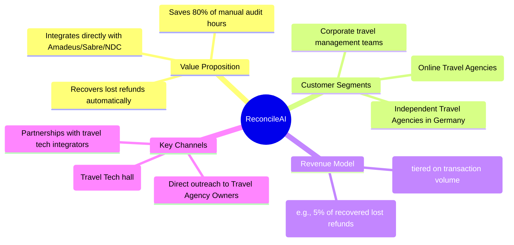
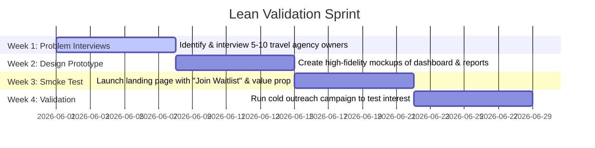

# Startup Proposal: AI-Powered Travel & Booking Tech

This document analyzes your 10-year industry expertise against market entry barriers in Germany, recommends the most viable sector, and outlines three concrete startup ideas with lean validation roadmaps.

---

## 1. Sector Evaluation: Where to Enter?

Given your experience in **Healthcare**, **Insurance**, and **Tourism/Booking**, we evaluate each sector on regulatory friction, sales cycles, and ease of entry as a solo founder or lean team:

| Sector | Regulatory Friction (EU AI Act & GDPR) | Typical Sales Cycle | Market Entry Ease | Verdict |
| :--- | :--- | :--- | :--- | :--- |
| **Healthcare / HealthTech** | 🔴 **High** (Clinical AI is classified as "High-Risk". HIPAA/GDPR health data rules are extremely strict). | 🔴 **Very Slow** (6–18 months dealing with public insurers, hospitals, or doctors). | 🔴 **Hard** | Avoid for an early-stage, lean, or self-funded launch. |
| **Insurance / InsurTech** | 🟡 **Medium-High** (Risk profiling, claims assessment can touch High-Risk AI Act criteria; heavily regulated by BaFin). | 🔴 **Slow** (Enterprise sales to major insurers require extensive compliance audits). | 🟡 **Medium-Hard** | Feasible only for B2B workflow tools, but slow to scale. |
| **Tourism & Travel Booking** | 🟢 **Low** (Most applications are classified as "Minimal Risk" under the EU AI Act. Low compliance overhead). | 🟢 **Fast** (B2C or B2B SaaS for independent travel operators, hotels, or agencies). | 🟢 **Easy** | **Highly Recommended** 🚀 (Leverages your domain knowledge of GDS/NDC APIs, booking engines, and flight inventories). |

---

## 2. Top 3 AI Startup Ideas in Travel & Booking Tech

Here are three high-potential ideas designed to be launched with minimal regulatory friction:

### Idea 1: "ReconcileAI" — B2B Automated Booking & Refund Reconciliation
*   **The Problem:** Travel agencies, OTAs, and corporate travel departments spend thousands of hours manually reconciling canceled flights, hotel refunds, invoice discrepancies, and chargebacks across multiple GDS platforms (Amadeus, Sabre) and NDC APIs.
*   **The AI Solution:** An AI agent that reads booking receipts, logs into travel APIs, reconciles transactions against bank statements/virtual credit cards, and flags discrepancies. It automatically writes and sends claim emails to airlines or hotels for missing refunds.
*   **Why it's easy to enter:** Purely B2B SaaS tool. No consumer acquisition costs. High, quantifiable ROI for agencies (saving time and reclaiming lost cash).
*   **Your Advantage:** Deep understanding of booking systems, flight/hotel APIs, and financial transactions.

### Idea 2: "PolicyPilot" — AI Travel Policy Assistant for German SMEs
*   **The Problem:** Mid-sized German companies (*Mittelstand*) travel frequently but rarely use expensive platforms like Amadeus Cytric. Employees spend hours searching for flights/hotels and trying to cross-reference them with complex corporate travel policies and German tax guidelines (e.g., per diem / *Verpflegungsmehraufwand* laws).
*   **The AI Solution:** A Slack/Teams integration where employees describe their trip (e.g., *"I need to visit a client in Munich next Tuesday"*). The AI agent finds flights/hotels, verifies they comply with company policies, drafts the booking, and automatically handles German per-diem tax calculations.
*   **Why it's easy to enter:** B2B SaaS targeting mid-market companies. Extremely low regulatory barrier.
*   **Your Advantage:** Experience building booking flows combined with understanding localized travel rules.

### Idea 3: "LocalConcierge" — White-label AI Concierge for Boutique Hotels & DMOs
*   **The Problem:** Independent boutique hotels and regional German Destination Management Organizations (DMOs) want to offer 24/7 multilingual guest support and personalized itineraries, but they suffer from severe staff shortages.
*   **The AI Solution:** A white-label WhatsApp/web chat assistant trained on local tourism databases, regional hiking trails, restaurant menus, and hotel services. It can answer guest questions ("*Where is the nearest child-friendly Italian restaurant open now?*") and directly trigger room service or book local tours using ticketing APIs.
*   **Why it's easy to enter:** High willingness to pay among hospitality operators struggling with hiring. Extremely visual, making it easy to sell with a simple interactive demo.
*   **Your Advantage:** Tourism domain expertise and booking API integration experience.

---

## 3. Deep Dive: Business Model Canvas for **ReconcileAI** (Top Pick)

We recommend **ReconcileAI** because B2B financial leakage tools have the fastest sales cycles and highest retention rates.

---

## 4. Lean Validation Roadmap (No-Code/Drafting Phase)

Before writing any code or setting up database infrastructures, validate the market demand using this 4-week validation sprint:

### 1. Week 1: Problem Interviews
*   **Objective:** Confirm that refund and booking reconciliation is a top 3 pain point.
*   **Action:** Reach out to German travel agency owners (find them via LinkedIn or local chamber of commerce directories).
*   **Crucial Question to Ask:** *"How do you currently track if a canceled flight has actually been refunded to your bank account, and how much time does that take?"*

### 2. Week 2: Mockups (Visual Sell)
*   **Objective:** Build a visual narrative without writing backend code.
*   **Action:** We can design an interactive frontend mockup of a dashboard that shows:
    *   Reconciled Bookings
    *   Discrepancies Found (e.g., *"Airline charged €50 more than quoted ticket price"*)
    *   Pending Refunds (e.g., *"Lufthansa owes €340 - 45 days outstanding"*)
    *   "Draft automated claim letter" button.

### 3. Week 3 & 4: Landing Page & Cold Outreach
*   **Objective:** Gauge actual intent (emails collected/waitlist signups).
*   **Action:** Setup a landing page using a simple static generator, describing the value proposition. Drive traffic via targeted cold LinkedIn messaging.
